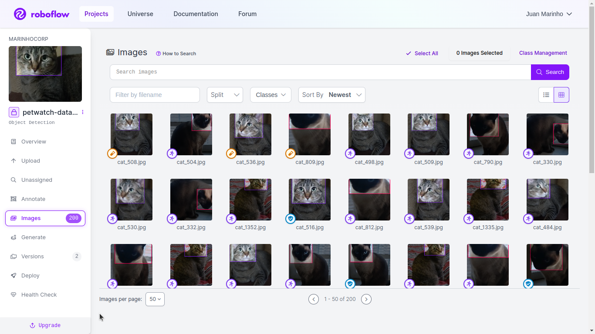

# Petwatch API Engine

----

## Contexto
O conjunto de dados para detecção computacional aplicado ao reconhecimento facial de gatos é projetado para treinar e avaliar algoritmos de detecção de objetos específicos para identificar rostos de gatos em imagens. Este conjunto de dados geralmente incluiria uma variedade de imagens que abrangem diversas condições, como diferentes posições dos gatos, iluminações, fundos e expressões faciais.

**Objetivo**: Treinar modelos de detecção de objetos para identificar e localizar rostos de gatos em imagens.

### 1. Dataset
**Formato das Anotações**: Cada imagem é acompanhada por anotações que indicam as coordenadas das bounding boxes que envolvem os rostos de gatos.

| dataset | quantidade | labels |
|---------|------------|--------|
| gatos   | 100        | lora|
| gatos   | 100        | uly|

|  |  |  |
|---------|------------|--------|
|    |         | 

### 2. Escolher Modelo

O Ultralytics YOLOv8 é um modelo de ponta, estado-da-arte (SOTA) que se baseia no sucesso das versões anteriores do YOLO e introduz novos recursos e melhorias para impulsionar ainda mais o desempenho e a flexibilidade. O YOLOv8 é projetado para ser rápido, preciso e fácil de usar, tornando-o uma excelente escolha para uma ampla gama de tarefas, como detecção e rastreamento de objetos, segmentação de instâncias, classificação de imagens e estimativa de pose.

Esperamos que os recursos aqui ajudem você a obter o máximo do YOLOv8. Por favor, consulte a documentação do YOLOv8 para obter detalhes, abra um problema no GitHub para suporte e junte-se à nossa comunidade no Discord para perguntas e discussões!

Para solicitar uma Licença Corporativa, por favor, preencha o formulário em Ultralytics Licensing.

### 3. Notebook Train
 

 

### 4. Tests

### 5. Deploy

